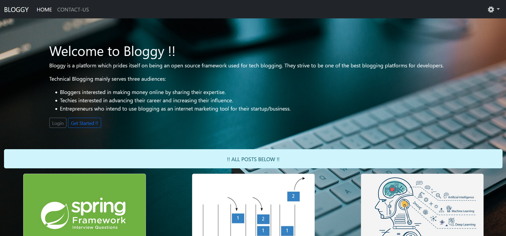
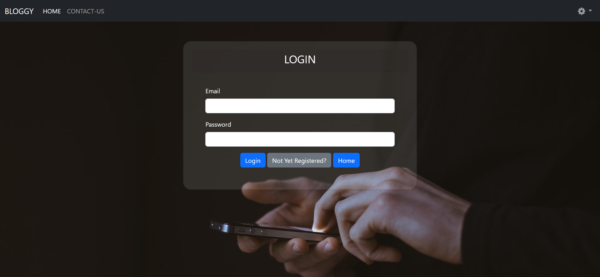
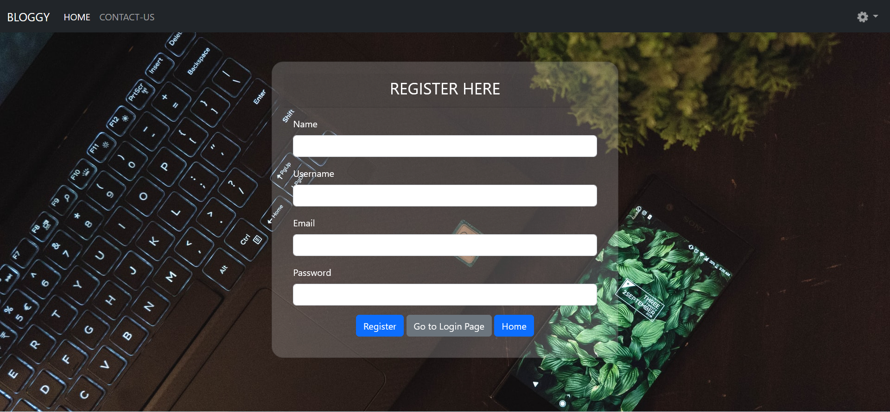
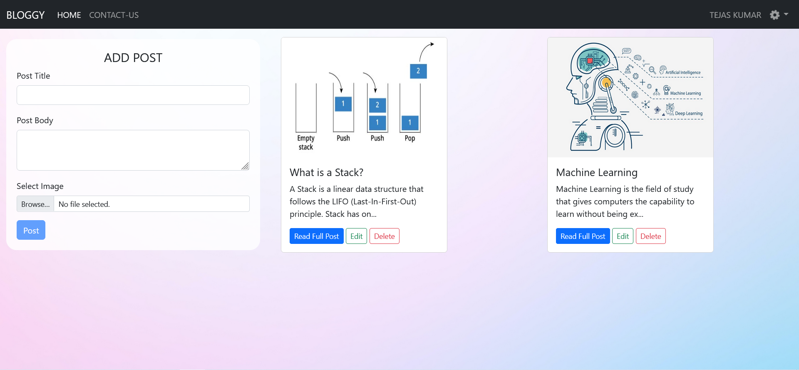

# Bloggy
Bloggy is a platform which prides itself on being an open source framework used for tech blogging. They strive to be one of the best blogging platforms for developers.
Technical Blogging mainly serves three audiences: 
* Bloggers interested in making money online by sharing their expertise.
* Techies interested in advancing their career and increasing their influence.
* Entrepreneurs who intend to use blogging as an internet marketing tool for their startup/business.
 
##### HOME PAGE


##### LOGIN PAGE


##### REGISTER PAGE


##### PROFILE PAGE


### QUICK GUIDE/STEPS TO RUN THE PROJECT:
1. Clone the project.
2. Download "Eclipse IDE for Enterprise Java and Web Developers" and unzip it.
3. Download and install MySQL installer community [ Workbench,MySQL command line ,MySQL Server ]
4. Download and Configure Tomcat 9.0 and add the server in Eclipse IDE.
5. The Projects needs to have multiple tables to be in place, Open MySQL shell and run below commands to create database and tables :

```
create database bloggy;
use bloggy;

create table user
(
 id int Primary Key auto_increment, 
name varchar(100) not null,
email varchar(100) not null unique,
username varchar(100) not null unique,
password varchar(100) not null,
regdate timestamp default now()
);


create table blog
(
 id int Primary Key auto_increment, 
title varchar(100) not null,
body varchar(10000) not null,
image varchar(100) not null,
postdate timestamp default now(),
userid int ,
 FOREIGN KEY (userid) REFERENCES user(id)
);
```


6. Open Eclipse IDE and import the cloned Project , and Click on Run Button.

Enjoy Bloggy !! 😊
